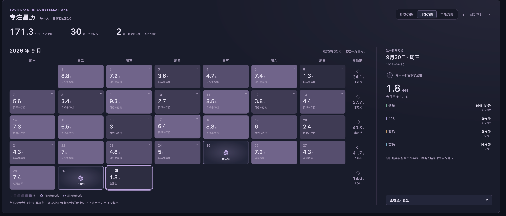
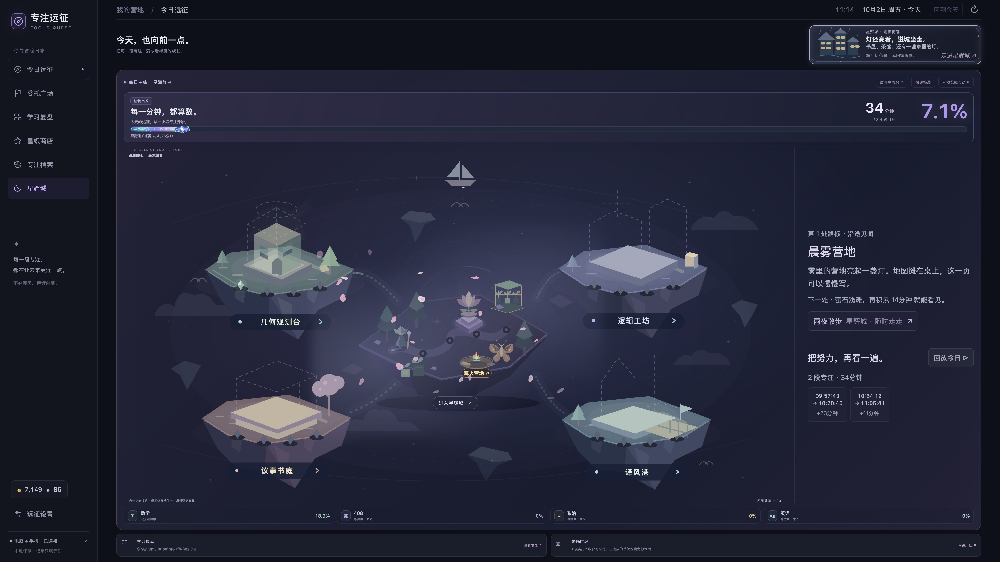
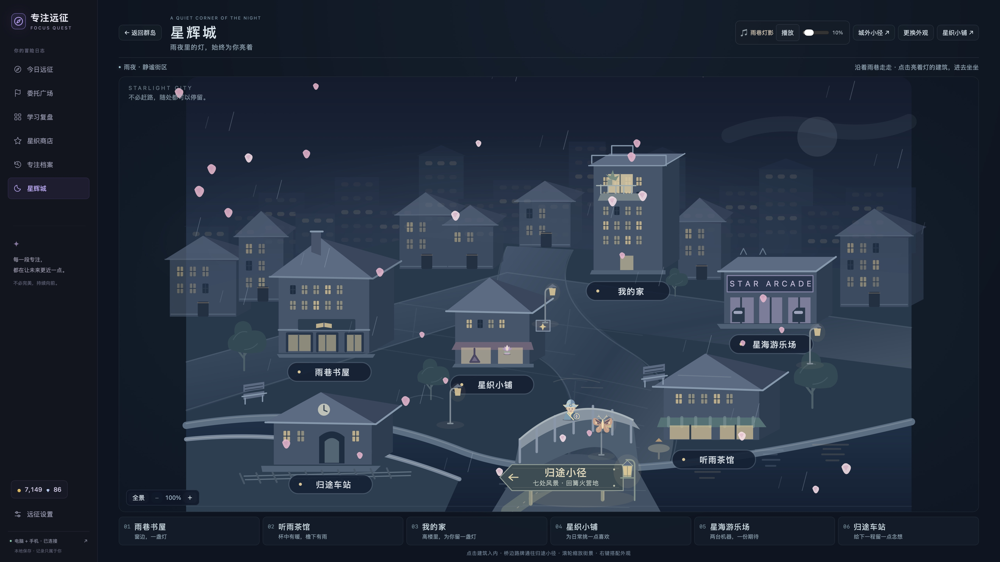

# 我的考研之路 · 专注远征

> “宗旨就是把这个仓库变成一个记录我的考研之路的仓库，而不是专注于项目本身。”

这里保存备考过程中留下的学习足迹：一段段专注、当时制定的计划、热力图里的日子，以及使用者曾经说过的想法。专注远征是陪伴这段过程的工具，它的界面、代码和新功能也顺带留在这里。

以后考上研、不再使用软件，仍然可以回来看看当时的记录。这个仓库的意义，从保存一个项目，变成了保存走过这一程的痕迹。

*画面选择 2026 年 9 月，当时显示 171.3 小时、30 天有过投入。原始拍摄日期与软件版本未知；这是旧截图中的汇总，不是后来重新统计的九月最终时长。*

## 已经留下的足迹

[2026 年 10 月 2 日 · 留下这一程](docs/memories/2026-10-02-v1.49.15/README.md)保存了上面的原始附件，以及当天从实际使用的原生应用中截取的群岛、周复盘与专注档案。

| 记录范围 | 可以从画面核对的投入 |
| --- | --- |
| 九月旧热力图 | 当时显示 171.3 小时，30 天有过投入 |
| 9 月 28 日至 10 月 4 日的一周，截至 10 月 2 日截取时 | 32 小时 19 分钟；当周目标 50 小时 |
| 10 月 2 日，截至截取时 | 34 分钟、2 段专注：数学做题 23 分钟，数学听课 11 分钟 |

这些范围有日期重叠，不相加；本周和当天尚未结束，也不把截图时的进度写成最终时长。每条留影保留所选日期、来源和可核对的说明。

更多记录会收在[备考留影](docs/memories/README.md)里，[备考中的想法](docs/memories/备考中的想法.md)另存当时亲口说过的话。真实学习记录与开发测试画面分别保存，测试数据、游戏得分和虚拟货币不当作学习成果。

## 以后怎样记录

每次由 Codex 完成新的项目更新并通过相应验证后，先保存适合留念的真实学习截图、能够核对的简短汇总，以及使用者在对话中明确说过的想法；随后将相应的代码与功能说明一并提交、推送到这个私有仓库。正式发布的软件版本也保存标签和安装包，便于看到当时软件的完整样子。同步失败时会明确说明待上传内容。

没有新的学习资料时，就记录这次实际发生的变化；不补写未经证实的学习时长、心情或经历。精选截图与汇总已经获准留存，完整学习数据库、日历快照、私人同步数据和账号凭据仍留在仓库之外。

## 陪伴这一程的软件

**专注远征 · Focus Quest** 是为个人考研备考制作的 macOS 学习辅助软件，当前为 **v1.49.15 · build 80**。番茄 ToDo 继续负责计时，它负责汇总电脑与手机的已完成专注，保留开始、结束时间和有效时长，并展示数学、408、政治、英语的每日目标与周计划。它不提供课程，也不替代学习本身。

首页的四个学科岛随各科进度建设；热力图按当时的目标回看每天的投入；知行研习所把听课和做题放在一起，鼓励自己动手练习。委托、学科礼盒与达标后的拾星给学习一些及时反馈，金币、钻石与票券均为软件里的虚拟奖励。

休息时，可以去路边的篝火营地，沿七处风景走到安静的雨夜城市；家里的窗、屋顶天台、书屋和茶馆都能停留。商店收藏让主岛、伙伴、进度条与主题逐渐变成喜欢的样子。抽奖与小游戏保留为可选内容，包括经典扫雷，游玩与收益设有每日边界。设置里还可以切换回第一版，看看一开始的模样。

看看陪伴备考的群岛与雨夜城市

*两张图均于 2026 年 10 月 2 日截取自实际使用的原生应用，未修改学习数值。场景与装饰记录当时的软件样子，学习数据以对应档案说明为准。*

## 代码与文档也留在这里

[版本索引](docs/版本索引.md)保存从 **v1.0 / build 1** 到 **v1.49.15 / build 80** 的 80 个运行源码版本。这些历史是后来从留存的发布应用中恢复、按版本建立的快照，不是原始开发提交；早期原生窗口源码没有完整留存，原始安装包另存在 [Releases](https://github.com/Jiang-liran/focus-quest/releases)。[早期画面](docs/memories/development-gallery/README.md)单独保存初版复原与艺术预览，明确标明测试或演示来源。

最新项目源码位于 `outputs/focus-quest/`：Python 与 SQLite 保存规则和本地状态，HTML、CSS、JavaScript 与 SVG 绘制界面，Swift / AppKit / WebKit 提供原生窗口。`outputs/手机同步诊断/` 保存独立的 EventKit 日历辅助程序；主服务仅监听本机 `127.0.0.1:18473`。

- [使用说明与功能更新](outputs/focus-quest/使用说明.md) · [项目详细介绍](outputs/专注远征_项目详细介绍.txt)（详细介绍整理于 v1.43）
- [最新安装包](https://github.com/Jiang-liran/focus-quest/releases/tag/v1.49.15) · [构建入口](outputs/focus-quest/macos/build.sh) · [开发验证记录](outputs/focus-quest/验证记录.md)
- [版本恢复说明](docs/版本恢复说明.md) · [备份核验说明](docs/备份核验说明.md) · [安装与恢复参考](docs/换电脑恢复指南.md)
