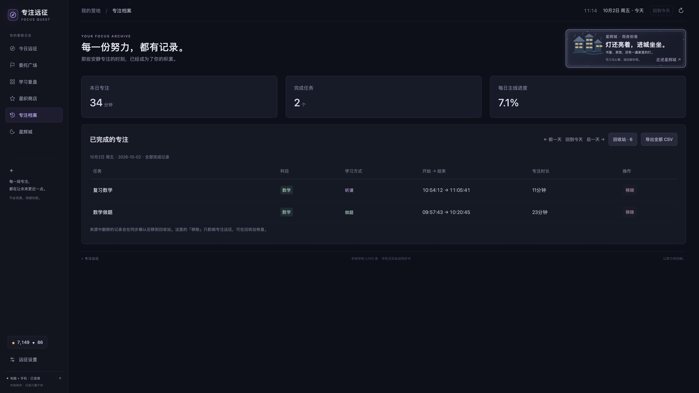

# 2026-10-02 · 留下这一程

> “主要是为了日后回忆起当前这个记录，所以我希望你上传到 GitHub 的时候，能附带一些截图和记录证明过我的努力。”
>
> —— 项目使用者，2026-10-02 对这份档案的要求

这份记录开始于项目完成第一次 GitHub 归档之后。它保存软件此时的样子，也留下几个可以从真实界面核对的学习片段。以后即使不再打开专注远征，仍然能看到当时的群岛、灯亮着的城市，以及每天留下的记录。

| 项目 | 记录 |
| --- | --- |
| 软件 | 专注远征 v1.49.15 / build 80 |
| 档案整理日期 | 2026-10-02，Asia/Shanghai（UTC+8） |
| 对应源码 | [v1.49.15](https://github.com/Jiang-liran/focus-quest/tree/v1.49.15) |
| 版本与安装包 | [v1.49.15 Release](https://github.com/Jiang-liran/focus-quest/releases/tag/v1.49.15) |
| 资料核对 | [截图摘要与精选学习记录](record.json) |

## 可以核对的学习足迹

以下是 2026-10-02 在正式应用中看到的学习记录。统计来自界面已有的完成记录，包含此前同步的学习；软件版本整理日期不是这些学习记录的发生日期。本周和当天尚未结束，这份截图不代表最终时长。

| 范围 | 界面显示的完成时长 | 说明 |
| --- | --- | --- |
| 2026-09-28 至 2026-10-04，本周截至截取时 | 32 小时 19 分钟 | 当周目标 50 小时，界面进度 64.6%；只有已完成记录进入累计 |
| 2026-09-28 | 7 小时 22 分钟 | 来自“本周足迹”日期条目 |
| 2026-09-29 | 9 小时 26 分钟 | 来自“本周足迹”日期条目 |
| 2026-09-30 | 4 小时 49 分钟 | 来自“本周足迹”日期条目 |
| 2026-10-01 | 10 小时 8 分钟 | 来自“本周足迹”日期条目 |
| 2026-10-02，截至截取时 | 34 分钟，2 段专注 | 当天记录为数学听课 11 分钟、数学做题 23 分钟；并非全天总量 |

这里的时长只说明软件记录到的学习投入。目标时长、游戏分数、金币、收藏数量和软件测试数量不作为学习时长，也不据此判断学习质量。

## 此时的群岛

2026-10-02 截取自本机正式应用，所选日期为 2026-10-02。首页保留了四科各自的岛屿与建设进度，主岛上的篝火是进入营地的入口。画面的当天进度是截取时已经同步的记录。

## 雨夜里的星辉城

2026-10-02 截取自本机正式应用。这座城市留下了“我的家”、书屋、茶馆、小铺、游乐场与车站。城市的雨夜、灯光和此时启用的装饰，记录了软件经过多次调整后的样子；场景画面本身不代表学习时长。

## 一周的积累

2026-10-02 截取自本机正式应用。周复盘显示 2026-09-28 至 2026-10-04 的累计进度，同时保留目标领航员与知行研习所的界面。这张图用于核对周汇总，不是完整热力图截图。

## 每一段专注都有开始和结束

2026-10-02 截取自本机正式应用，所选日期为 2026-10-02。当天两段已经完成的记录是：

| 任务 | 界面学习方式 | 开始 → 结束（当地时间） | 界面计入时长 |
| --- | --- | --- | --- |
| 数学做题 | 做题 | 09:57:43 → 10:20:45 | 23 分钟 |
| 复习数学 | 听课 | 10:54:12 → 11:05:41 | 11 分钟 |

时长按软件显示的整数分钟保存，不从截图中重新估算。任务名称与学习方式均照原界面记录。

## 你曾发来的九月星历

这是使用者此前在对话里提供的原始截图，2026-10-02 整理入档。画面选择 2026 年 9 月及 9 月 30 日，月汇总当时显示 **171.3 小时、30 天有过投入**。它保留了那时已经留下的学习痕迹，也保留了后来继续改进的热力图样式。

原始拍摄日期和当时软件版本未能独立核实；171.3 小时是旧画面的显示值，不能写成今天重新统计的九月最终时长。它与上面的当周记录有日期重叠，不能再相加。

## 软件的来路与以后

[早期画面](../development-gallery/README.md)另存了初版界面复原和群岛、营地的艺术预览，明确标注为测试或演示，不混入上面的真实学习汇总。[版本索引](../../版本索引.md)则保留 80 个已恢复版本的源码入口。

从这一天起，后续项目更新完成并通过适当验证后，同步提交源码、代表性截图和简短记录到 GitHub。正式软件发布同时保存标签与安装包。仅整理资料不增加软件版本号。

本档案只保留精选截图与可核对汇总，不含完整学习数据库、原始日历与同步数据、账号配置或认证材料。四张新截图和一张历史附件均保留原图，未修改学习数值；未见无关账号、邮箱或凭据。截图中的应用时钟属于界面显示，采集日期以本档案说明为准。
