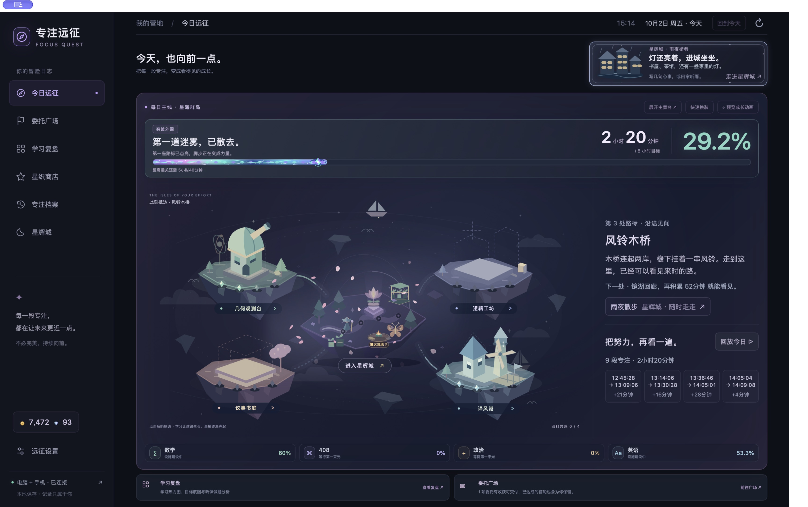
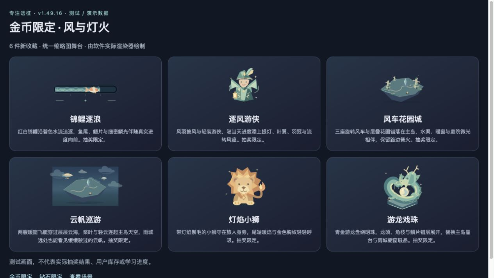
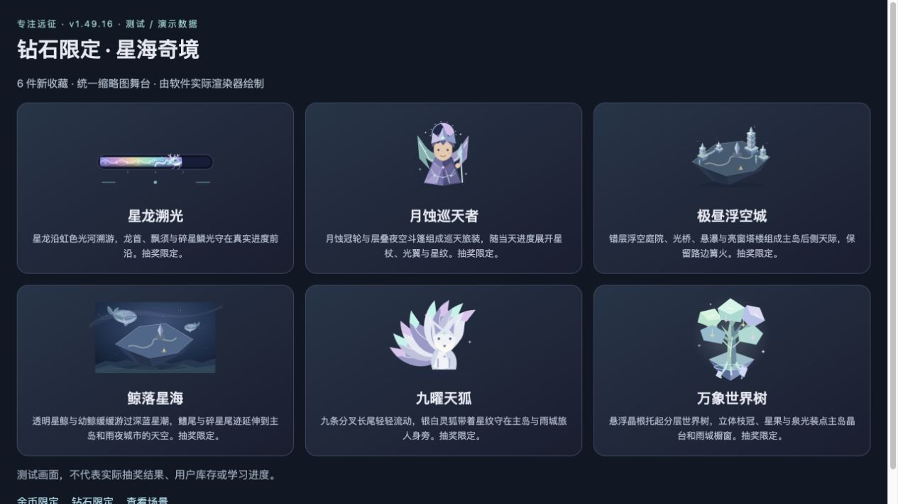
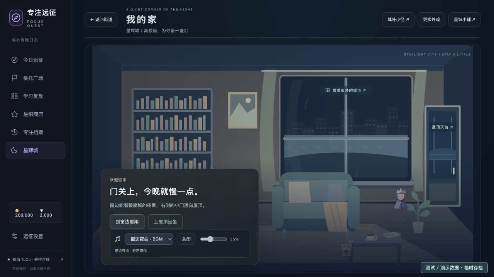
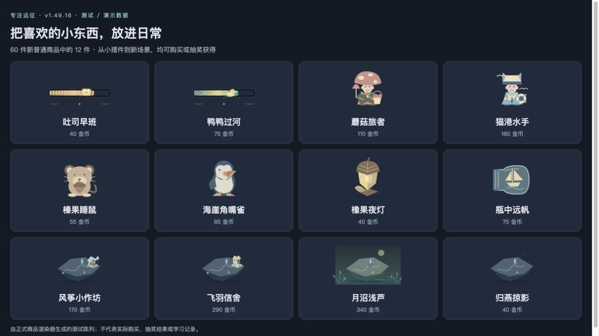

# 2026-10-02 · 让身边的世界，再多一点生气

这一页留下使用者对陪伴和收藏的新想法：宠物可以活泼一点，普通商品和限定收藏也各有自己的样子。备考中的这些小选择，与软件一起保存。

## 留下的真实足迹

2026 年 10 月 2 日 15:14，正式应用的首页显示：当天已完成 **9 段专注，共 2 小时 20 分钟**，相当于当天 8 小时总目标的 **29.2%**。这是截取当时的日内累计，尚不是当天最终结果，也不能与同日早先截图相加。

学习发生日期：2026-10-02；截图时间：2026-10-02 15:14，Asia/Shanghai；整理日期：2026-10-02。来源为已安装正式应用的原生全屏首页，未修改学习记录。8 小时是计划，并非已学时长。

九月热力图与同日早些时候的资料仍保留在[上一份档案](../2026-10-02-v1.49.15/README.md)。下方的商品与家中画面来自测试 / 演示环境，不代表使用者实际获得的收藏，也不用于统计学习投入。

## 当时说过的话

以下均为使用者在本次项目对话中的原话，发言及整理日期为 2026-10-02，时区 Asia/Shanghai。

> 再扩充一轮金币抽奖机和钻石抽奖机的限定商品吧 要足够酷炫

> 同时再次极大丰富商店里商品数量 发挥你的想象力和创造力 尽可能丰富多彩

> 优化一下宠物 目前宠物只是一个放在我旁边的贴图 有点呆 让它灵动起来

使用者还要求：限定商品作为一组保留风格，优先调整与之相似的可购买商品。软件的这一轮变化由这几句话而来，没有另行代写备考心情。

## 代表性画面

本节四张演示截图日期及整理日期均为 **2026-10-02，Asia/Shanghai**。画面没有学习日期范围；来源是隔离的本地预览或临时测试存档，使用本版实际渲染代码。展示了商品和搭配变化，没有真实账号资料；截图未含 EXIF/XMP 元数据。测试库与钱包数据不上传。

### 金币限定 · 测试 / 演示数据

锦鲤、风车、云帆与灯焰小狮留下了这一轮收藏的轮廓。陈列不代表用户已获得这些奖品。

### 钻石限定 · 测试 / 演示数据

星龙、浮空城、星鲸、九尾狐和世界树各有独立造型；与金币收藏保留不同的尺度和细节。

### 家中的伙伴 · 测试 / 演示数据

伙伴留在旅人身边，靠近时作出小小回应。图中钱包和收藏均为测试数据，不代表真实奖励或学习量。

### 普通收藏 · 测试 / 演示数据

从进度条和衣装，到伙伴、摆设、建筑与自然场景，保留一些能慢慢挑选的小东西。

## 软件也走到了这里

本版新增 60 件普通商品及 12 件限定，总目录 408 项；两机各 18 件限定。普通 24%、限定直出 1% 与 40 / 25 抽保底规则不变。伙伴获得分物种待机、局部动作与靠近回应；六件旧普通商品重绘以区分限定主题，保留原价和购买权益。详细内容见[使用说明](../../../outputs/focus-quest/使用说明.md)。

| 项目 | 记录 |
| --- | --- |
| 软件版本 / 构建号 | 1.49.16 / 81 |
| 软件发布日期 / 档案整理日期 | 2026-10-02，Asia/Shanghai |
| 源码 | [v1.49.16 标签](https://github.com/Jiang-liran/focus-quest/tree/v1.49.16) |
| 对应安装包 | [GitHub Release](https://github.com/Jiang-liran/focus-quest/releases/tag/v1.49.16)，FocusQuest-v1.49.16-macOS.zip |
| ZIP SHA-256 | `3893935b08607fdd4e82c7be9419b39ee30b7e13a73915e5f45ba4436b84ea3f` |

## 核对与资料边界

- 软件验证与学习记录分开：621 项 Python 测试、1011 项 Node 测试通过，另核对独立测试界面的主岛搭配、商店分类、伙伴试装、城市与家中交互。
- 安装包已严格验签；安装后 127 个资源与源码一致，50 张存档数据表保留，核对钱包、已购收藏、装备、奖券和保底未重置。
- 原生全屏首页与正式存档已核对。真实截图只记录 10 月 2 日 15:14 时的日内累计；四张商品和家中演示图不计入学习汇总，没有代写用户未表达的经历。
- 原始数据库、账户与同步资料、私人备份未放入仓库或安装包。
