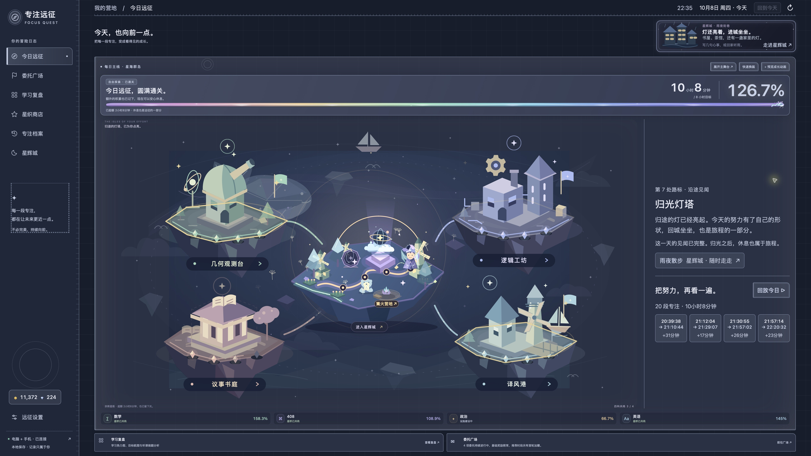
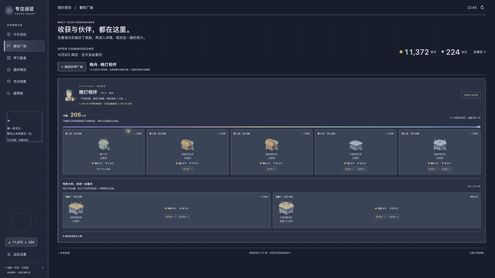

# 2026-10-08 · 有些累，但总算坚持下来了

这一页留下的是一个有学习成果、也感到疲惫的夜晚。数字和当时的话一起保存，往后回来翻看时，能看见完成了多少，也能读到完成这些时的真实感受。

## 当时说过的话

2026 年 10 月 8 日，使用者在项目对话中要求上传代码，并留下这段原话：

> 代码上传一次github 因为今天的学习成果还不错 但此刻我的心情有些沮丧 因为有些累 我感觉晚上以后的学习格外需要意志力 但我总算是坚持下来了

随后又说：

> 以后每次上传github的时候 除了保留我的原话 你也可以适当为我补充一些内容 因为我的语言总是简要的

**整理补记（由 Codex 根据上述原话与下方真实汇总补充）：** 今天留下了 20 段已完成专注，累计 10 小时 8 分钟。数学、408、政治、英语都有投入；其中做题共 2 小时 45 分钟。到了晚上，18 点后的有效学习仍累计到约 3 小时 25 分钟，五份常规晚间礼盒和第一份可选加赠已经收好。学习成果不错，疲惫和沮丧也同时存在。这一晚值得留下的，是你在这样的状态里继续学了下去，并亲口说出了“但我总算是坚持下来了”。

补记用于补足记录背景，与原话明确区分；没有据此推测考试结果、题目掌握情况或其他未说过的经历。

## 留下的真实足迹

学习发生日期为 **2026-10-08**，时区 **Asia/Shanghai**。下表来自正式应用首页、晚灯相伴详情及同一正式服务的汇总接口，截图时间为当晚 22:35 与 22:44，汇总接口于 22:59 再次核对；这是截取时的日内累计，尚不写作当天最终总量。

| 内容 | 截取时的实际投入 | 当日目标 |
| --- | --- | --- |
| 已完成专注 | 20 段，共 **10 小时 8 分钟** | 总目标 8 小时，进度 126.7% |
| 数学 | 4 小时 45 分钟 | 3 小时 |
| 408 | 3 小时 16 分钟 | 3 小时 |
| 政治 | 40 分钟 | 1 小时 |
| 英语 | 1 小时 27 分钟 | 1 小时 |
| 按现有学习方式分类的听课 / 做题 | 7 小时 23 分钟 / 2 小时 45 分钟 | 不设置方式比例目标 |
| 18:00—24:00 窗口内，截至截取时 | 约 **3 小时 25 分钟**，界面显示 205 分钟 | 150 分钟为五份常规奖励；185 / 220 分钟为两份可选加赠 |

四科分钟合计为 608，听课与做题合计同为 608。数学、408、英语已达到各科目标，政治仍为 40 / 60 分钟；总目标达成不等于四科全部达标。学习方式按应用现有分类统计，不据时长评价掌握程度。

晚间数值属于全天学习的一部分，**不与全天 608 分钟相加**。晚间模块只计算已完成学习在 18:00—24:00 内的有效部分，跨时段按比例切分、重叠区间去重；后台结果约 205.27 分钟，界面取整显示 205。截图中的常规五盒与第一份加赠是使用者此前已领取的状态，本次留影没有执行领奖。

## 代表性画面

### 今晚的群岛 · 真实学习记录

- 截图时间：2026-10-08 22:35:39，Asia/Shanghai；画面所选日期为 10 月 8 日。
- 来源：已安装正式应用 v1.49.36 / build 101 的原生首页。
- 留下它的原因：今日总进度、四科各自建设状态，以及晚间最近几段真实专注都留在同一个画面里。

### 晚灯还亮着 · 真实学习记录

- 截图时间：2026-10-08 22:44:39，Asia/Shanghai；学习日期为 10 月 8 日，统计窗口为 18:00—24:00，截至截图时。
- 来源：同一正式应用的晚舟详情。
- 留下它的原因：让“晚上以后的学习格外需要意志力”这句话，旁边有能核对的晚间投入。

两张真实画面均未修改学习记录、目标、装备或奖励状态。图片只进行 JPEG 压缩及元数据剥离，可见数值保持原样；已检查没有无关账号、身份信息、通知或凭据。

## 软件也走到了这里

这次上传保存最近积累的本机更新，源码版本为 **v1.49.36 / build 101**。晨光启程礼按第一段专注的开始时间给鼓励；晚灯相伴把五份常规奖励设在累计 2 小时 30 分钟，额外两档保留为可选；六位奖励伙伴集中到广场，方便查看与领取。四科建筑可以各自选择，并随进度按部件修建；城里有居民，伙伴也能在合法区域随机散步。

最近一版的金币机与钻石机都支持五连抽、十连抽，结果集中展示，逐抽推进保底。更完整的逐版变化见[使用说明](../../../outputs/focus-quest/使用说明.md)，实际检查见[验证记录](../../../outputs/focus-quest/验证记录.md)。

### 十连抽结果 · 测试 / 演示数据

截图日期与整理日期：2026-10-08，Asia/Shanghai；来源为独立临时存档的功能验证。画面中的货币、收藏和背景学习数据均为测试内容，**不代表使用者实际收获，不计入上述学习足迹**。

## 核对与资料边界

- 档案整理日期：2026-10-08，Asia/Shanghai；汇总口径与来源保存在 [record.json](record.json)，只保留精选汇总字段。
- 上传前复验：675 项 Python 后台测试、1149 项 Node 界面测试全部通过。修正晨光测试的功能启用时间夹具，使其不依赖运行当天的日期；没有因此修改正式奖励规则。
- 本次保存当前代码与纪念资料，没有增加软件版本号、创建新版本标签或发布安装包。最近公开安装包仍为 [v1.49.16](https://github.com/Jiang-liran/focus-quest/releases/tag/v1.49.16)。中间本机版本的变化见使用说明，本次没有将它们补写成独立的远端开发提交。
- 原始学习数据库、同步与日历原始数据、私人备份和凭据继续留在仓库之外。精选截图与汇总是纪念资料，不能替代私人存档备份。
