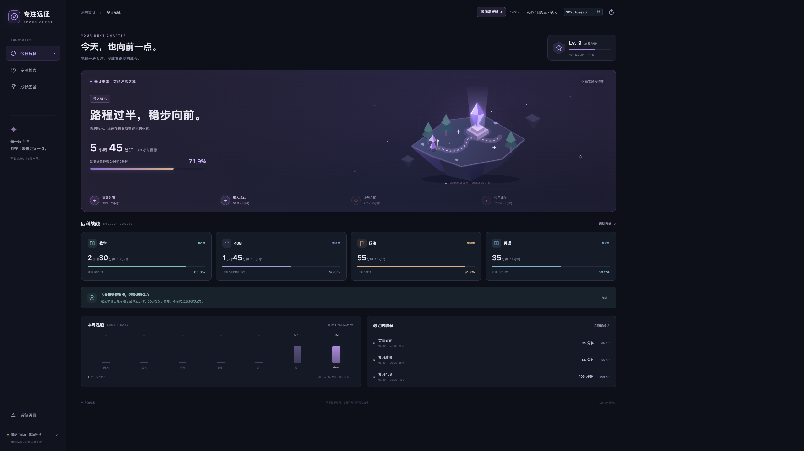
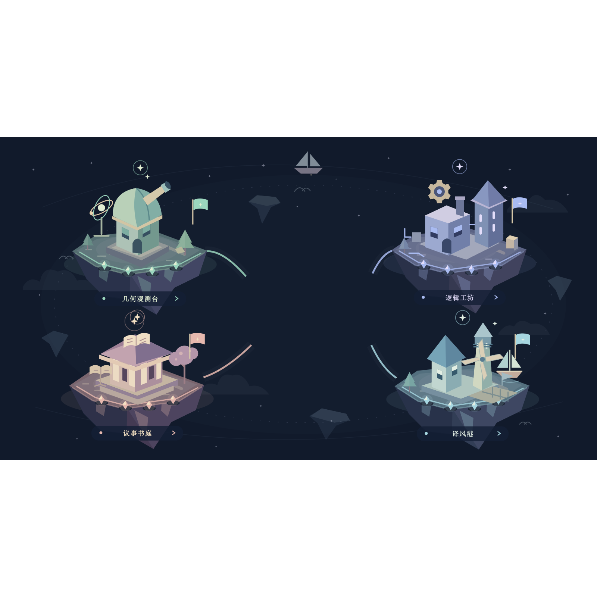
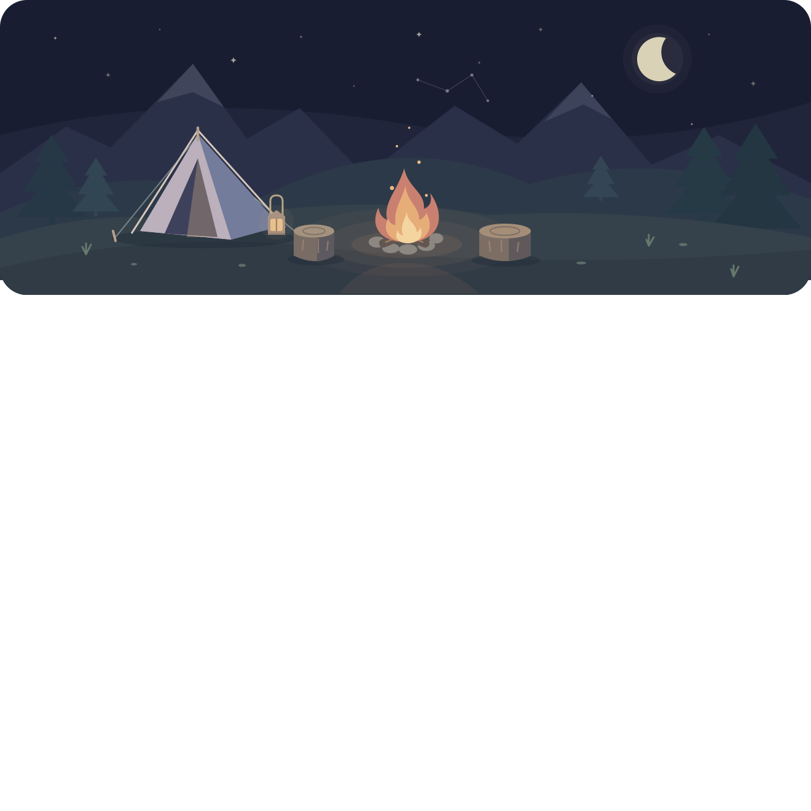

# 专注远征 · 开发画廊

整理日期：2026-10-02。

这里保存三张历史测试图片，记录浮空岛、四科群岛与篝火营地的视觉演变。它们是 **QA 界面截图或艺术预览，不是真实学习努力记录**。画面中的学习时长、进度和达标状态不得作为实际投入证明。

三张图片的原始拍摄或渲染日期均未知。本次整理没有使用文件修改时间推测拍摄日期；图片原样复制，未裁剪或改写。文件名中的编号仅用于画廊顺序。

| 图片 | 画面来源 | 原始拍摄/渲染日期 | 原始尺寸 |
| --- | --- | --- | --- |
| [01-classic-v1-qa.png](screenshots/01-classic-v1-qa.png) | v1.0 经典界面复原，使用合成 QA 数据 | 未知 | 2560 × 1440 |
| [02-islands-art-preview.png](screenshots/02-islands-art-preview.png) | 四科群岛艺术预览，固定满建设状态 | 未知 | 1600 × 1600 |
| [03-camp-art-preview.png](screenshots/03-camp-art-preview.png) | 早期篝火营地场景艺术预览 | 未知 | 1320 × 1320 |

## 最初的浮空岛

紫色浮空岛、四科进度与成长等级构成了最初的首页。此图来自 `work/classic-switch/classic-fullscreen.png`，是后续测试时复原的 v1.0 展示，不是初版发布现场截图。原画面显示 2026/09/30，但所选日期不能证明实际拍摄日。

配套 `work/classic-switch/prepare.py` 从 `outputs/初版软件-v1.0/专注远征.app/Contents/Resources/static` 恢复初版资源，并记录来源 v1.0 / build 1；`browser_qa.cjs` 明确生成此截图。配套 `qa_server.py` 使用隔离数据，预置学习记录与余额，所以画面中的“5 小时 45 分”等数值属于测试状态。

相关历史版本：[v1.0 源码](https://github.com/Jiang-liran/focus-quest/tree/v1.0)。完整版本关系见[版本索引](../../版本索引.md)，其中 v1.44 的“回到最初的远征”记录了经典界面恢复阶段。

## 四科远征群岛

几何观测台、逻辑工坊、议事书庭与译风港，让四科进度变成四处可见的风景。此图来自 `work/expedition-art-review/world-100.svg.png`，是配套 SVG 的艺术渲染预览；SVG 固定 `data-world-progress="1"` 与各岛 `data-percent="100"`。它不代表用户曾在某天完成四科目标。

[版本索引](../../版本索引.md)中，v1.13 / build 18 对应“星海群岛主舞台”；同期核验脚本目标也为该版本。图片本身没有版本水印，因此它与具体发布 build 的精确对应未知。

## 月光下的营地

帐篷、木桩、群山与一簇篝火，是早期“星岛篝火夜话”的场景设计。此图来自 `work/campfire-art-qa/scene.svg.png`，配套 `scene.svg` 的标题为“星岛篝火夜话”，仅包含场景艺术，没有用户学习状态。

[版本索引](../../版本索引.md)中，v1.10 / build 15 对应“篝火夜话”。这提供功能阶段背景；该图的精确软件版本未知。

## 图像核对

三张副本与源文件逐字节一致。经典图没有 PNG 文本、EXIF 或日期元数据；群岛与营地图的 EXIF 仅包含像素尺寸。未发现原始拍摄日期、GPS 或账号字段。目视检查未见姓名、账号、凭据或外部应用窗口。

这组图片用于记住软件怎样逐渐长成。真实学习记录保存在各次更新的回忆档案中，并单独说明捕获来源及当时画面。
